# Lab 16 - Kubernetes Monitoring & Init Containers

## 1. Stack Components

- Prometheus Operator: Kubernetes controller that manages Prometheus/Alertmanager CRDs and reconciles monitoring resources.
- Prometheus: time-series database that scrapes metrics from cluster components and workloads.
- Alertmanager: receives alerts from Prometheus and groups/routes notifications.
- Grafana: dashboards and visualization for metrics and alerts.
- kube-state-metrics: exposes Kubernetes object state metrics (Deployments, Pods, PVCs, etc.).
- node-exporter: exposes host/node-level CPU, memory, filesystem, and network metrics.

## 2. Install Kube-Prometheus Stack

```bash
helm repo add prometheus-community https://prometheus-community.github.io/helm-charts
helm repo update

helm upgrade --install monitoring prometheus-community/kube-prometheus-stack \
  --namespace monitoring \
  --create-namespace

kubectl get po,svc -n monitoring
```

Expected: all core pods become `Running` (operator, Prometheus, Alertmanager, Grafana, kube-state-metrics, node-exporter).

## 3. Grafana and Alertmanager Access

```bash
kubectl port-forward svc/monitoring-grafana -n monitoring 3000:80
# login: admin / prom-operator

kubectl port-forward svc/monitoring-kube-prometheus-alertmanager -n monitoring 9093:9093
```

Useful dashboards:

- Kubernetes / Compute Resources / Namespace (Pods)
- Kubernetes / Compute Resources / Pod
- Node Exporter / Nodes
- Kubernetes / Kubelet

## 4. Dashboard Answers (Task 2)

Record your measured values from Grafana/Alertmanager (with screenshots):

1. Pod resources (StatefulSet CPU/memory):
   - CPU:
   - Memory:
2. Default namespace most/least CPU pod:
   - Most:
   - Least:
3. Node metrics:
   - Memory %:
   - Memory MB:
   - CPU cores:
4. Kubelet managed objects:
   - Pods:
   - Containers:
5. Network traffic (default namespace pods):
   - RX/TX highlights:
6. Alertmanager:
   - Active alerts count:
   - Notable alert names:

Screenshots for Task 2:

- `k8s/lab16_screens/02-grafana-namespace_pod_memory.png`
- `k8s/lab16_screens/03-grafana-pod-resources_cpu.png`
- `k8s/lab16_screens/04-grafana-node-metrics.png`
- `k8s/lab16_screens/05-grafana-kubelet.png`
- `k8s/lab16_screens/06-grafana-network.png`
- `k8s/lab16_screens/07-alertmanager-alerts.png`

## 5. Init Containers - Download File Pattern

Manifest:

- `k8s/init-containers/init-download-demo.yaml`

Apply and verify:

```bash
kubectl apply -f k8s/init-containers/init-download-demo.yaml
kubectl get pods -l app=init-download-demo -w
kubectl logs deploy/init-download-demo -c init-download
kubectl exec deploy/init-download-demo -- head -n 5 /usr/share/nginx/html/index.html
```

Success criteria:

- Pod transitions `Init:0/1 -> Running`
- init container logs show successful `wget`
- main container can read downloaded file from shared `emptyDir`

Real output (from run):

```text
deployment.apps/init-download-demo created
NAME                                  READY   STATUS              RESTARTS   AGE
init-download-demo-77bf957974-k72t2   0/1     Init:0/1            0          1s
init-download-demo-77bf957974-k72t2   0/1     PodInitializing     0          7s
init-download-demo-77bf957974-k72t2   1/1     Running             0          14s

Connecting to example.com (172.66.147.243:443)
wget: note: TLS certificate validation not implemented
saving to '/work-dir/index.html'
index.html 100% saved

<!doctype html><html lang="en"><head><title>Example Domain</title>...
```

## 6. Init Containers - Wait-for-Service Pattern

Manifest:

- `k8s/init-containers/init-wait-demo.yaml`

Apply and verify:

```bash
kubectl apply -f k8s/init-containers/init-wait-demo.yaml
kubectl get pods -l app=init-wait-demo -w
kubectl logs deploy/init-wait-demo -c wait-for-service
kubectl logs deploy/init-wait-demo -c app
```

Success criteria:

- init container resolves `wait-target.default.svc.cluster.local`
- main container starts only after dependency DNS is resolvable

Real output (from run):

```text
service/wait-target created
deployment.apps/wait-target created
deployment.apps/init-wait-demo created
NAME                              READY   STATUS              RESTARTS   AGE
init-wait-demo-7bf548fbc9-z7xx6   0/1     Init:0/1            0          0s
init-wait-demo-7bf548fbc9-z7xx6   0/1     PodInitializing     0          1s
init-wait-demo-7bf548fbc9-z7xx6   1/1     Running             0          2s

Name:   wait-target.default.svc.cluster.local
Address: 10.96.79.22

dependency resolved
```

## 7. Bonus - ServiceMonitor for App Metrics

Implemented in Helm chart:

- `k8s/devops-python/templates/servicemonitor.yaml`
- `k8s/devops-python/values.yaml` (`serviceMonitor.*`)
- `k8s/devops-python/values-monitoring.yaml` (enabled profile)

Deploy app with ServiceMonitor:

```bash
helm upgrade --install lab16-app k8s/devops-python \
  -n lab16 --create-namespace \
  -f k8s/devops-python/values-monitoring.yaml \
  --set hooks.enabled=false \
  --set vault.enabled=false

kubectl get servicemonitor -n lab16
kubectl get svc -n lab16
```

Prometheus verification:

```bash
kubectl port-forward svc/monitoring-kube-prometheus-prometheus -n monitoring 9090:9090
```

In Prometheus UI, verify target and query:

- `up{namespace="lab16"}`
- `http_requests_total{namespace="lab16"}`

Real output (from run):

```text
kubectl get servicemonitor -n lab16
NAME                      AGE
lab16-app-devops-python   2m7s

kubectl get svc -n lab16
NAME                               TYPE        CLUSTER-IP      EXTERNAL-IP   PORT(S)   AGE
lab16-app-devops-python            ClusterIP   10.96.160.149   <none>        80/TCP    2m7s
lab16-app-devops-python-headless   ClusterIP   None            <none>        80/TCP    2m7s

kubectl get pods -n lab16
NAME                        READY   STATUS    RESTARTS   AGE
lab16-app-devops-python-0   1/1     Running   0          2m7s
lab16-app-devops-python-1   1/1     Running   0          110s
```

Traffic generation used for metric updates:

```text
curl http://127.0.0.1:18080/
curl http://127.0.0.1:18080/
curl http://127.0.0.1:18080/metrics > /dev/null
```

Prometheus bonus evidence screenshots:

- `k8s/lab16_screens/10-servicemonitor-created.png`
- `k8s/lab16_screens/11-prometheus-up-lab16.png`
- `k8s/lab16_screens/12-prometheus-http-requests-lab16.png`

## 8. Evidence Checklist

Required:

1. `kubectl get po,svc -n monitoring` output
2. Grafana screenshots answering all 6 dashboard questions
3. Init download demo proof:
   - init logs
   - file content from main container
4. Init wait-for-service proof:
   - init logs
   - main container start logs

Bonus:

5. `kubectl get servicemonitor -n lab16` output
6. Prometheus UI screenshot/query results showing app metrics scraped

## 9. Screenshot Bundle (This Submission)

All screenshots were saved to `k8s/lab16_screens/`:

1. `01-monitoring-pods-services.png`
2. `02-grafana-namespace_pod_memory.png`
3. `03-grafana-pod-resources_cpu.png`
4. `04-grafana-node-metrics.png`
5. `05-grafana-kubelet.png`
6. `06-grafana-network.png`
7. `07-alertmanager-alerts.png`
8. `08-init-download-proof.png`
9. `09-init-wait-proof.png`
10. `10-servicemonitor-created.png`
11. `11-prometheus-up-lab16.png`
12. `12-prometheus-http-requests-lab16.png`

Embedded preview:

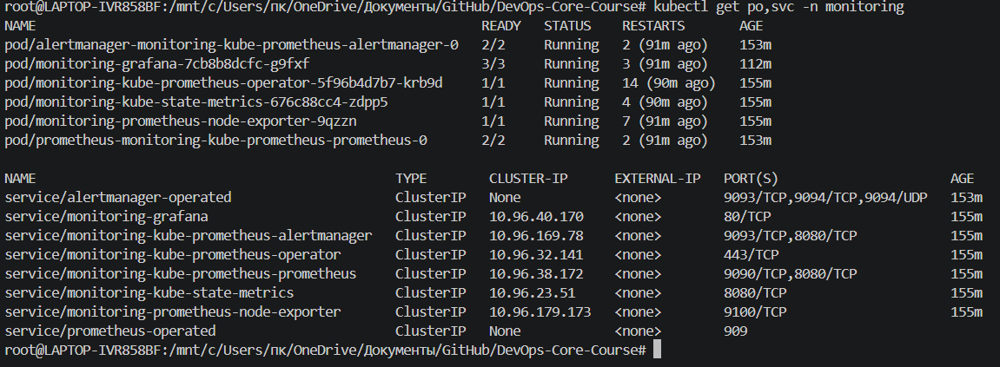
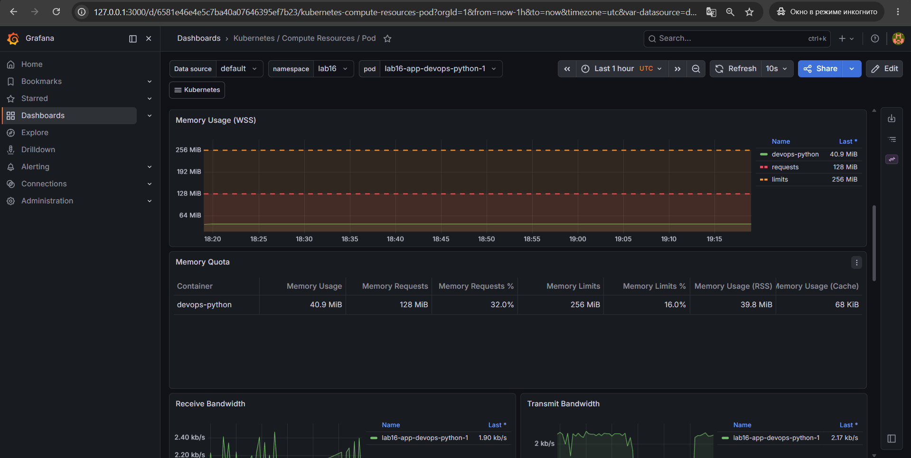
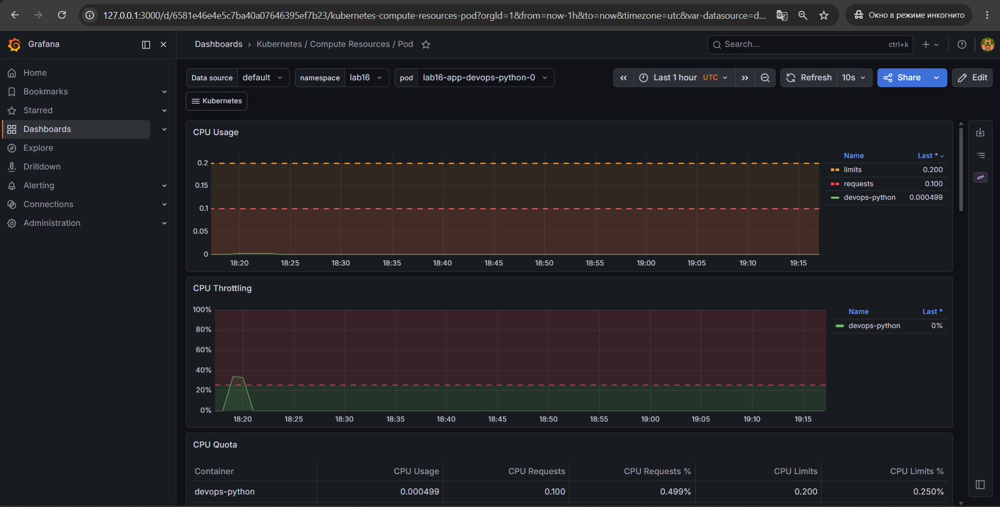
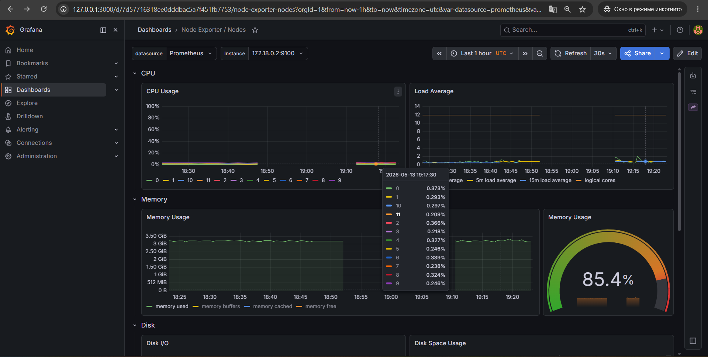
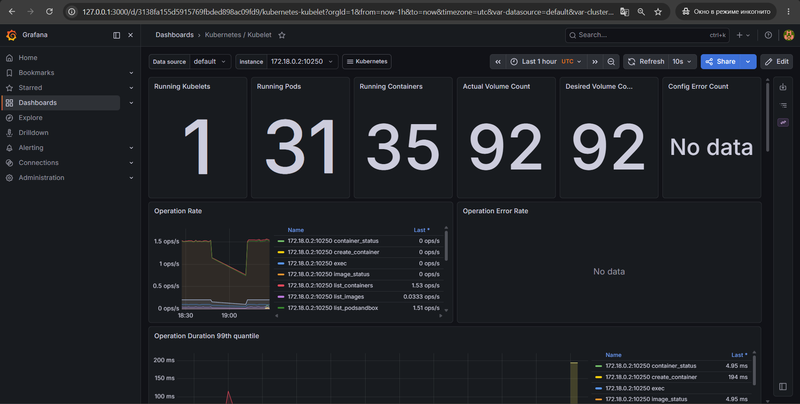
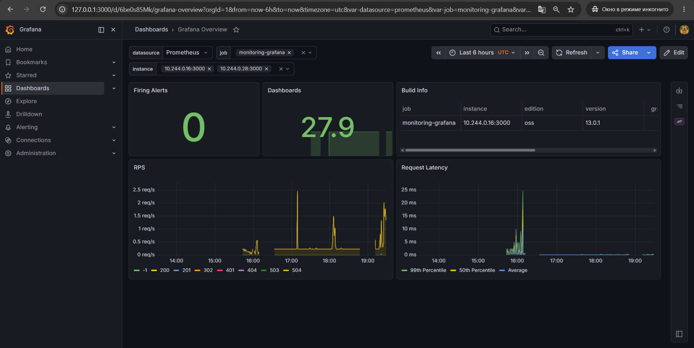
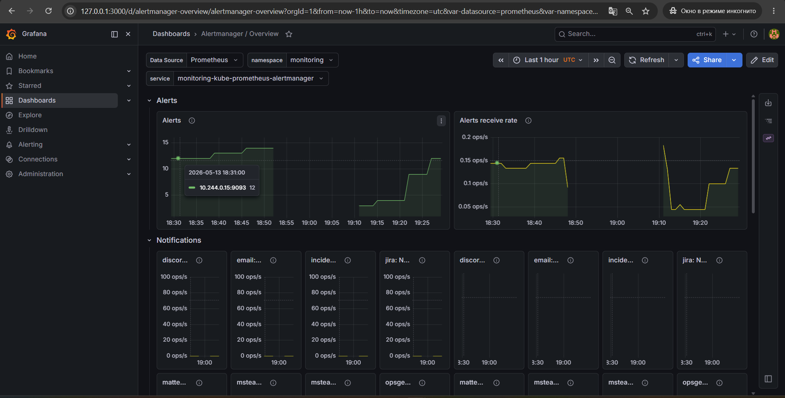
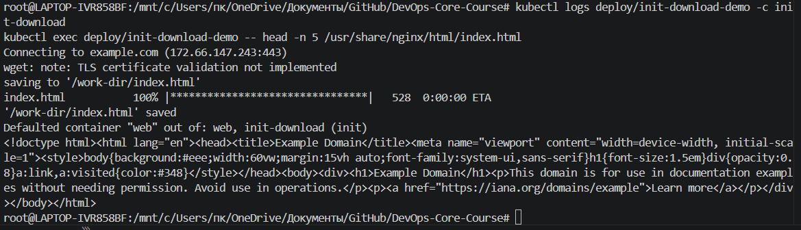
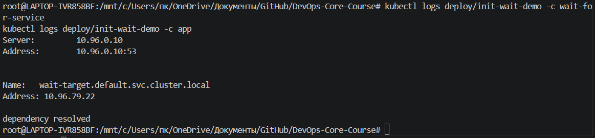
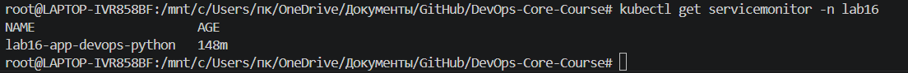
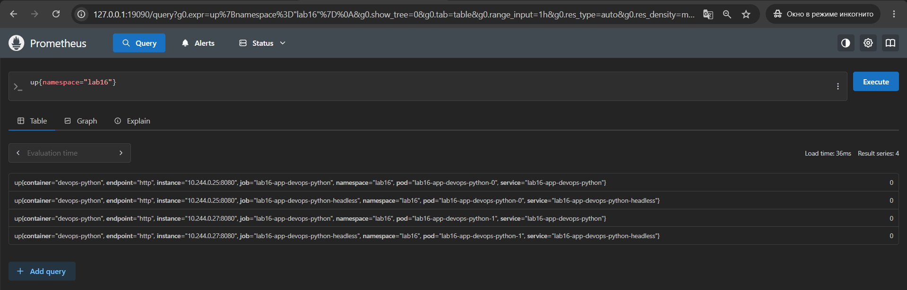
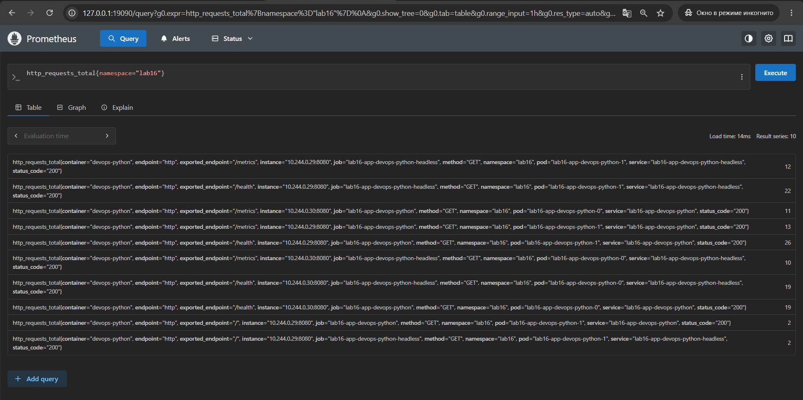
