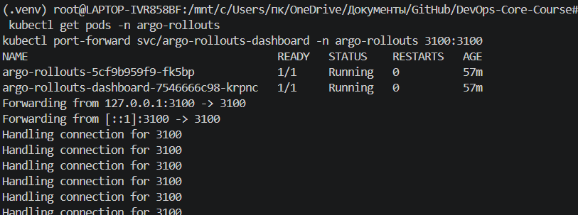
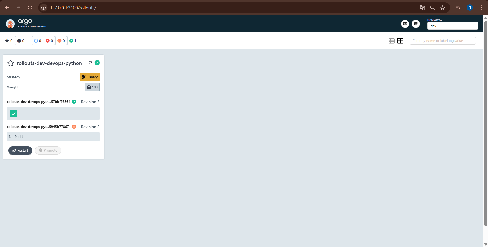
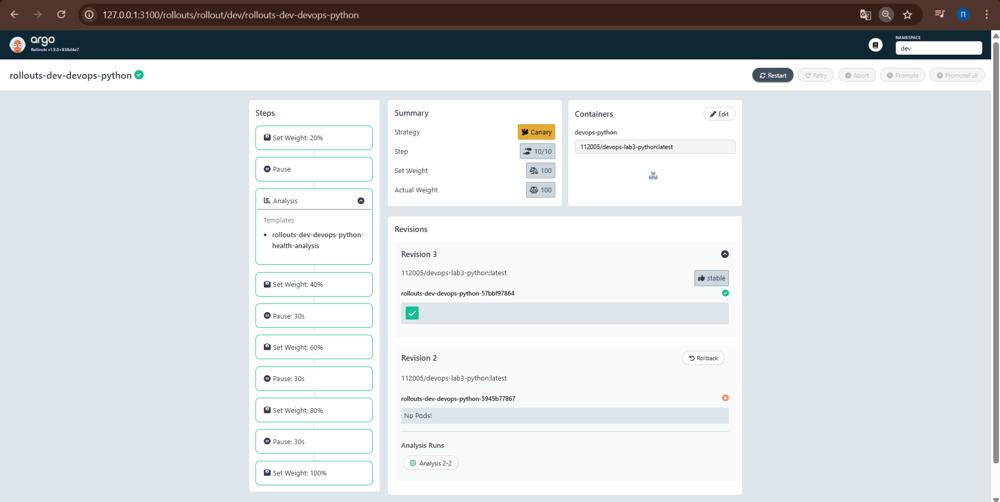
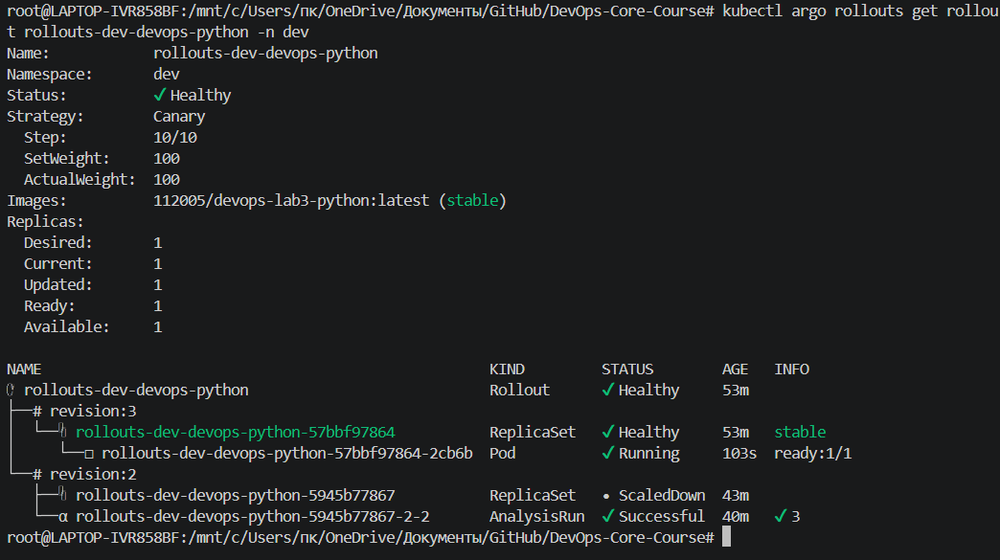
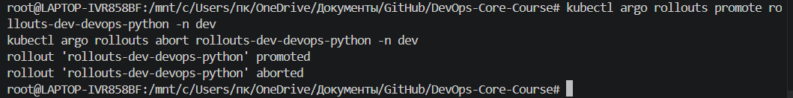
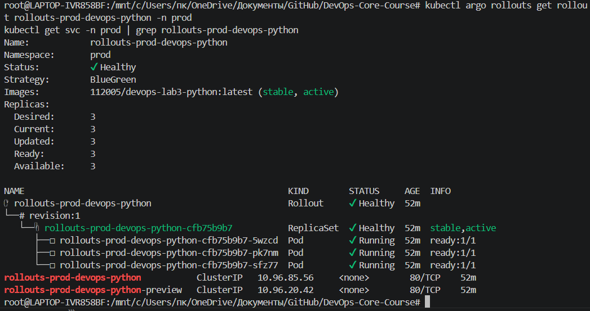
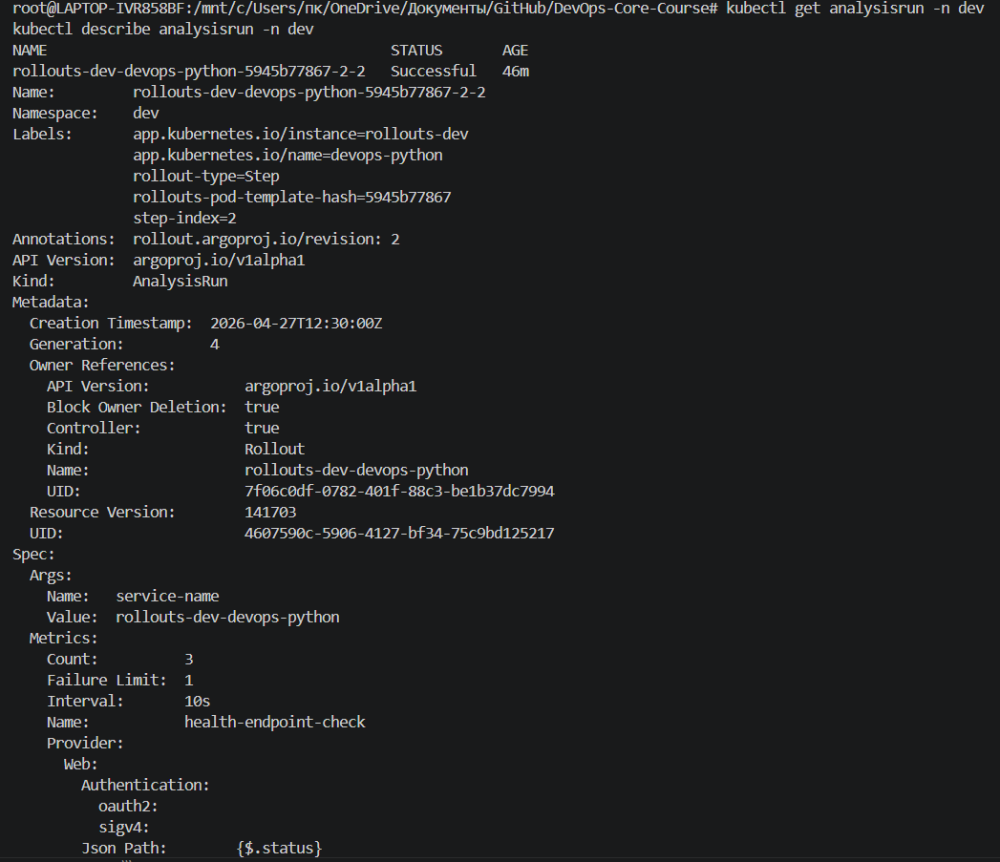
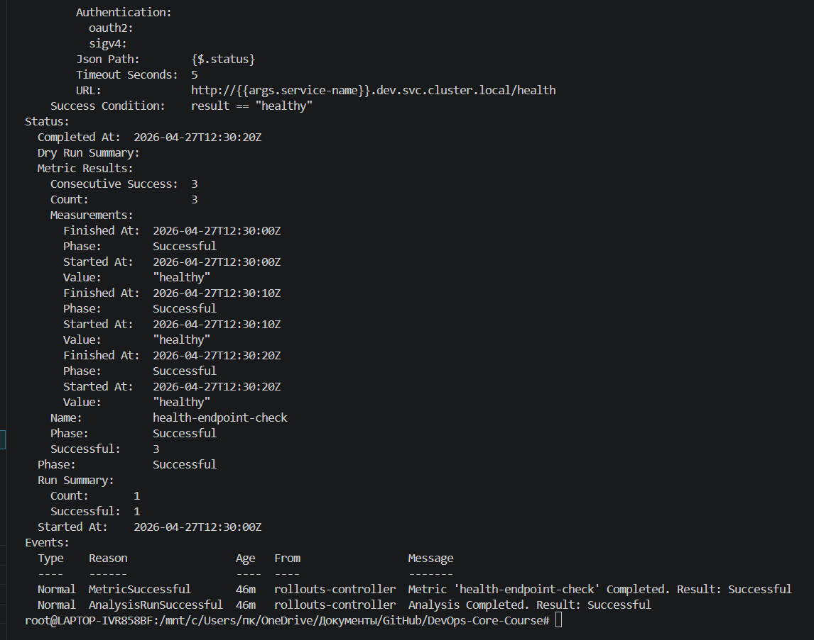

# Lab 14 - Progressive Delivery with Argo Rollouts

## 1. Argo Rollouts Setup

### 1.1 Install controller

```bash
kubectl create namespace argo-rollouts --dry-run=client -o yaml | kubectl apply -f -
kubectl apply -n argo-rollouts -f https://github.com/argoproj/argo-rollouts/releases/latest/download/install.yaml
kubectl get pods -n argo-rollouts
```

### 1.2 Install kubectl plugin

```bash
curl -fL -o /tmp/kubectl-argo-rollouts https://github.com/argoproj/argo-rollouts/releases/latest/download/kubectl-argo-rollouts-linux-amd64
install /tmp/kubectl-argo-rollouts /usr/local/bin/kubectl-argo-rollouts
chmod +x /usr/local/bin/kubectl-argo-rollouts
kubectl argo rollouts version
```

### 1.3 Install dashboard

```bash
kubectl apply -n argo-rollouts -f https://github.com/argoproj/argo-rollouts/releases/latest/download/dashboard-install.yaml
kubectl get svc -n argo-rollouts argo-rollouts-dashboard
kubectl port-forward svc/argo-rollouts-dashboard -n argo-rollouts 3100:3100
```

Open: `http://127.0.0.1:3100`

---

## 2. Chart Changes (Implemented)

Implemented in Helm chart `k8s/devops-python`:

- New Rollout template:
  - `templates/rollout.yaml`
- Existing Deployment guarded (disabled when rollout enabled):
  - `templates/deployment.yaml`
- Preview service for canary/blue-green:
  - `templates/service-preview.yaml`
- Bonus AnalysisTemplate:
  - `templates/analysis-template.yaml`
- Rollout values/config:
  - `values.yaml`
  - `values-dev.yaml`
  - `values-prod.yaml`
- Helper names:
  - `templates/_helpers.tpl`

### Strategy mapping

- Dev (`values-dev.yaml`): `canary` + analysis enabled
- Prod (`values-prod.yaml`): `blueGreen` + manual promotion

---

## 3. Canary Deployment (Task 2)

### 3.1 Canary configuration

Canary steps implemented in `templates/rollout.yaml`:

- `20% -> pause (manual)`
- analysis step (bonus)
- `40% -> pause 30s`
- `60% -> pause 30s`
- `80% -> pause 30s`
- `100%`

### 3.2 Deploy and observe

```bash
helm upgrade --install rollouts-dev k8s/devops-python \
  -n dev --create-namespace \
  -f k8s/devops-python/values-dev.yaml \
  --set hooks.enabled=false \
  --set vault.enabled=false

kubectl argo rollouts get rollout rollouts-dev-devops-python -n dev -w
```

### 3.3 Trigger new rollout and manual promotion

```bash
helm upgrade rollouts-dev k8s/devops-python \
  -n dev \
  -f k8s/devops-python/values-dev.yaml \
  --set image.tag=canary-v2 \
  --set hooks.enabled=false \
  --set vault.enabled=false

kubectl argo rollouts get rollout rollouts-dev-devops-python -n dev -w
kubectl argo rollouts promote rollouts-dev-devops-python -n dev
```

### 3.4 Abort/rollback test

```bash
kubectl argo rollouts abort rollouts-dev-devops-python -n dev
kubectl argo rollouts get rollout rollouts-dev-devops-python -n dev
kubectl argo rollouts retry rollout rollouts-dev-devops-python -n dev
```

---

## 4. Blue-Green Deployment (Task 3)

### 4.1 Blue-green configuration

In prod values and rollout strategy:

- `strategy: blueGreen`
- `activeService: <fullname>`
- `previewService: <fullname>-preview`
- `autoPromotionEnabled: false`

### 4.2 Deploy and validate active/preview

```bash
helm upgrade --install rollouts-prod k8s/devops-python \
  -n prod --create-namespace \
  -f k8s/devops-python/values-prod.yaml \
  --set hooks.enabled=false \
  --set vault.enabled=false

kubectl get svc -n prod
kubectl argo rollouts get rollout rollouts-prod-devops-python -n prod -w
```

### 4.3 Test preview and promote

```bash
kubectl -n prod port-forward svc/rollouts-prod-devops-python 18080:80
kubectl -n prod port-forward svc/rollouts-prod-devops-python-preview 18081:80

# terminal 2
curl http://127.0.0.1:18080/health
curl http://127.0.0.1:18081/health

kubectl argo rollouts promote rollouts-prod-devops-python -n prod
```

### 4.4 Rollback speed test

```bash
kubectl argo rollouts undo rollouts-prod-devops-python -n prod
kubectl argo rollouts get rollout rollouts-prod-devops-python -n prod
```

Blue-green rollback is near-instant service switch, compared to gradual canary rollback.

---

## 5. Bonus - Automated Analysis

### 5.1 AnalysisTemplate implemented

`templates/analysis-template.yaml` includes web metric:

- Request: `http://<service>.<namespace>.svc.cluster.local/health`
- JSONPath: `{$.status}`
- Success condition: `result == "healthy"`
- `interval: 10s`, `count: 3`, `failureLimit: 1`

### 5.2 Integrated with canary

Canary strategy includes analysis step after first `20%` stage.

Behavior:

- if analysis passes -> rollout continues
- if analysis fails -> rollout enters failed state and can be aborted/rolled back

### 5.3 Failure simulation

```bash
# example: break health endpoint via bad image/env
helm upgrade rollouts-dev k8s/devops-python \
  -n dev \
  -f k8s/devops-python/values-dev.yaml \
  --set image.tag=nonexistent-tag \
  --set hooks.enabled=false \
  --set vault.enabled=false

kubectl argo rollouts get rollout rollouts-dev-devops-python -n dev -w
kubectl argo rollouts get analysisruns -n dev
```

---

## 6. Rollout vs Deployment (Key Differences)

- `Rollout` supports canary/blue-green progressive strategies.
- `Rollout` supports manual promotion, abort, retry, undo.
- `Rollout` supports `AnalysisTemplate` for metric-driven progression.
- `Deployment` only supports RollingUpdate/Recreate, no native progressive traffic steps.

---

## 7. ArgoCD Integration for Lab 14

Added optional ArgoCD app manifests for this lab:

- `k8s/argocd/application-rollouts-dev.yaml`
- `k8s/argocd/application-rollouts-prod.yaml`

Apply:

```bash
kubectl apply -f k8s/argocd/application-rollouts-dev.yaml
kubectl apply -f k8s/argocd/application-rollouts-prod.yaml
argocd app list
```

Note: `targetRevision` is set to `lab14`. Keep it aligned with your real working branch.

---

## 8. Useful CLI Commands Reference

```bash
kubectl argo rollouts list rollouts -A
kubectl argo rollouts get rollout <name> -n <ns> -w
kubectl argo rollouts promote <name> -n <ns>
kubectl argo rollouts abort <name> -n <ns>
kubectl argo rollouts retry rollout <name> -n <ns>
kubectl argo rollouts undo <name> -n <ns>
kubectl argo rollouts dashboard
kubectl argo rollouts get analysisrun -n <ns>
```

---

## 9. Evidence Checklist

Capture screenshots/outputs for submission:

1. Argo Rollouts controller + dashboard pods/services in `argo-rollouts`
2. Canary progression in dashboard (20 -> 40 -> 60 -> 80 -> 100)
3. Manual promote and abort outputs
4. Blue/preview service behavior and promotion
5. AnalysisRun success/failure output
6. Strategy comparison summary

---

## 10. Real Run Evidence (Your Environment)

### 10.1 Controller, plugin, dashboard

```bash
kubectl get pods -n argo-rollouts
# argo-rollouts + argo-rollouts-dashboard pods are Running

kubectl argo rollouts version
# kubectl-argo-rollouts: v1.9.0
```

Dashboard was opened via:

```bash
kubectl port-forward svc/argo-rollouts-dashboard -n argo-rollouts 3100:3100
```

### 10.2 Canary (dev)

Install:

```bash
helm upgrade --install rollouts-dev k8s/devops-python -n dev --create-namespace -f k8s/devops-python/values-dev.yaml --set hooks.enabled=false --set vault.enabled=false
```

Observed:

```bash
kubectl get rollout -n dev
# NAME                         DESIRED   CURRENT   UP-TO-DATE   AVAILABLE
# rollouts-dev-devops-python   1         1         1            1

kubectl argo rollouts get rollout rollouts-dev-devops-python -n dev
# Status: Healthy
# Strategy: Canary
# Step: 10/10
# SetWeight: 100
# ActualWeight: 100
```

Manual restart test:

```bash
kubectl argo rollouts restart rollouts-dev-devops-python -n dev
kubectl argo rollouts get rollout rollouts-dev-devops-python -n dev --watch
# Progressing -> Healthy (expected behavior)
```

### 10.3 Blue-Green (prod)

Install:

```bash
helm upgrade --install rollouts-prod k8s/devops-python -n prod --create-namespace -f k8s/devops-python/values-prod.yaml --set hooks.enabled=false --set vault.enabled=false
```

Observed:

```bash
kubectl argo rollouts get rollout rollouts-prod-devops-python -n prod
# Strategy: BlueGreen
# Status: Healthy
# Replicas Ready/Available: 3/3
```

Active + preview services:

```bash
kubectl get svc -n prod | grep rollouts-prod-devops-python
# rollouts-prod-devops-python
# rollouts-prod-devops-python-preview
```

Promotion:

```bash
kubectl argo rollouts promote rollouts-prod-devops-python -n prod
# rollout promoted
```

### 10.4 Bonus analysis

Template exists:

```bash
kubectl get analysistemplate -n dev
# rollouts-dev-devops-python-health-analysis
```

Successful analysis run evidence:

```bash
kubectl get analysisrun -n dev
# rollouts-dev-devops-python-5945b77867-2-2   Successful

kubectl describe analysisrun -n dev
# Status.Phase: Successful
# Metric health-endpoint-check: Successful (3/3)
# Events include AnalysisRunSuccessful
```

---

## 11. Screenshot Placement (Exact)

Screenshots are stored in:

`k8s/lab14_screens/`

Used files:

1. `01-pods-running.png` - controller/dashboard pods are running
2. `01-dashboard-dev.png` - dashboard opened for dev rollout
3. `02-steps-dashboard.png` - canary steps visible in dashboard
4. `02-strategy-canary.png` - canary rollout details/strategy view
5. `03-canary-promote-abort.png` - terminal output for promote/abort
6. `04-bluegreen-prod.png` - blue-green rollout healthy in prod
7. `05-bonus-analysis-success_p1.png` - AnalysisRun list/status
8. `05-bonus-analysis-success_p2.png` - AnalysisRun describe details

If your teacher accepts screenshots outside git (LMS/Telegram), you can skip committing this folder and just upload these screenshots there.

### 11.1 Embedded screenshots

Task 1 - controller/dashboard:




Task 2 - canary progression:





Task 3 - blue-green:



Bonus - automated analysis:



